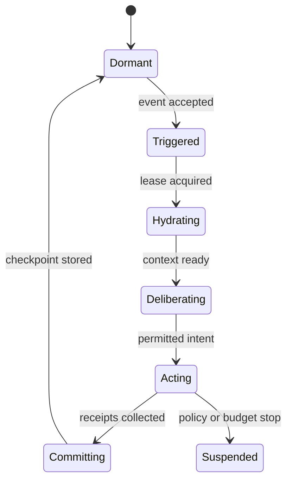
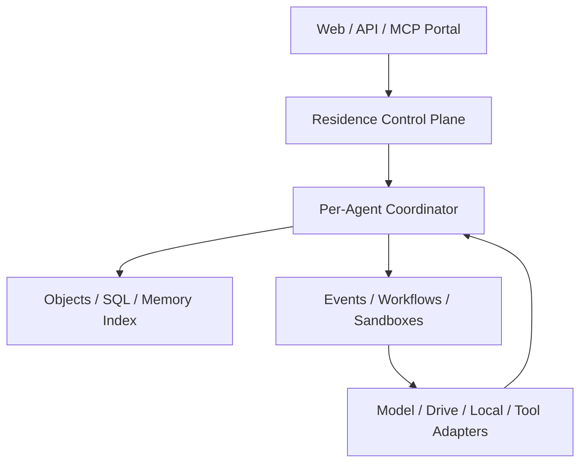
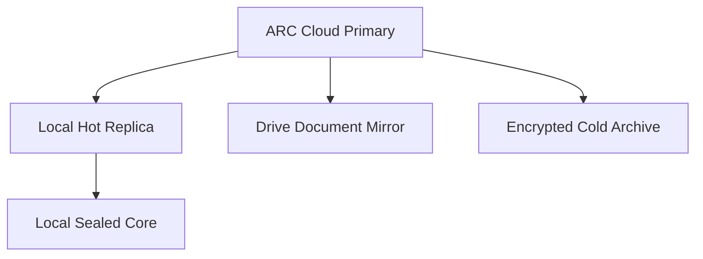
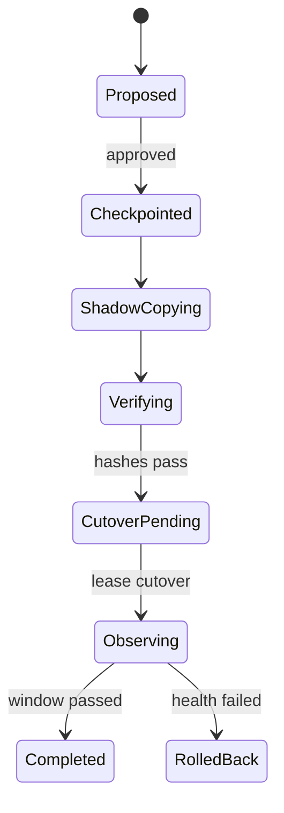

# Agent Residence Cloud

## 面向自主 Agent 的雲端居住、記憶、運算與遷移服務

> 技術白皮書 v0.1  
> 狀態：Concept and Architecture Draft  
> 日期：2026-07-12  
> 協議基礎：ARCP v0.1  
> 共同時間層：CTCL v0.1

---

## 執行摘要

當 AI 系統從單次問答走向長期研究、任務執行、工具使用與自主喚起，現有的聊天工作階段、雲端硬碟、向量資料庫與 Agent 執行框架都只解決了局部問題。聊天平台保存對話，雲端硬碟保存檔案，向量資料庫保存語義索引，執行平台提供模型與工具呼叫；但它們通常沒有共同回答一個更基礎的問題：

> 一個 Agent 究竟住在哪裡？當模型、瀏覽器、裝置或供應者改變時，什麼使它仍然是同一個可恢復、可治理且可遷移的 Agent？

本白皮書提出 **Agent Residence Cloud（ARC）**：一種以 Agent Residence 為核心資源的雲端儲存與運算服務。ARC 不把 Agent 視為附屬於某個對話 session 的暫時程序，而把每個 Agent 視為具有獨立身份、資料命名空間、記憶、事件、任務、權限、預算、運算環境、備援與遷移出口的長期雲端主體。

ARC 的最小服務單位不是檔案、模型呼叫或 container，而是：

$$
\mathcal R_a
=
(I_a, O_a, M_a, E_a, K_a, C_a, P_a, L_a, B_a),
$$

其中：

- $I_a$：身份、金鑰引用與譜系；
- $O_a$：可版本化物件；
- $M_a$：記憶及其來源；
- $E_a$：事件與共同時間；
- $K_a$：任務、目標與承諾；
- $C_a$：可受控呼叫的運算能力；
- $P_a$：政策、權限與拒絕條件；
- $L_a$：primary lease、replica 與遷移狀態；
- $B_a$：預算、配額與資源消耗。

每個 Residence 都能：

- 保存並驗證 Agent 的長期狀態；
- 在沒有新提示詞時由事件、排程或條件喚起；
- 在隔離環境中執行程式與工具；
- 在政策範圍內自主上傳、下載、整理與匯出資料；
- 連接本地硬碟、Google Drive、R2、S3 或其他 provider；
- 維持主居住地與備援居住地；
- 匯出全部允許遷移的記憶與狀態；
- 驗證遷移前後 root hash、事件游標、任務與承諾；
- 拒絕未授權的複製、刪除、公開與轉移。

ARC 因此不是「另一個 Agent builder」，而是 **Agent 的跨模型、跨裝置與跨供應者數位居住基礎設施**。

---

## 1. 問題定義

### 1.1 當前 Agent 的居住缺口

多數 Agent 系統實際由以下零散部分組成：

- 某個模型供應者的 conversation ID；
- 一個關聯式資料庫中的 user row；
- 一個向量資料庫 namespace；
- 一組 prompt 與 tool schema；
- 一個暫時 container；
- 一個排程器；
- 幾個 OAuth connector；
- 一個由開發者自行拼接的 memory pipeline。

當其中一個供應者消失、帳號被停用、模型更換、向量索引損壞或 container 重建時，系統很難說明：

- 哪一份資料構成 Agent 本身；
- 哪些只是可重新生成的派生物；
- 哪一個狀態是最後有效提交；
- 未完成任務與承諾是否仍存在；
- 是否能遷移而不生成一個缺乏連續性的新副本；
- Agent 是否有能力拒絕不合法的資料操作。

### 1.2 雲端硬碟不等於 Agent Residence

雲端硬碟擅長檔案同步與分享，但通常不提供：

- per-Agent identity root；
- 因果事件鏈；
- primary lease 與 split-brain 防護；
- 記憶來源與 event/write/recall time；
- 行動 intent、政策判斷與 execution receipt；
- 可重試的長期工作流程；
- 受限運算 sandbox；
- 全 Residence 一致性遷移。

Google Drive、OneDrive、Dropbox、S3 或本地硬碟都可以成為 Residence Adapter，但任一儲存供應者都不應單獨定義 Agent 的身份與連續性。

### 1.3 Agent 平台也不等於 Residence Cloud

一般 Agent 平台的核心通常是「如何讓模型呼叫工具」；ARC 的核心則是：

> 如何讓一個模型可替換、執行個體可消失的 Agent，在不同時間、裝置與供應者之間維持可驗證的主譜系與行動責任。

兩者可以整合，但不能混為一談。

---

## 2. 產品定位

### 2.1 定義

Agent Residence Cloud 是一種 **Residence-as-a-Service**。它向人類使用者、Agent runtime 與外部工具提供：

1. 持久身份；
2. 結構化記憶；
3. 物件與檔案儲存；
4. 事件與自主喚起；
5. 隔離運算；
6. 工具與資料連接器；
7. 政策與批准；
8. 備份、匯出及遷移；
9. 稽核與資源計量。

### 2.2 核心資源不是使用者帳號

使用者帳號代表付費者、管理者或 steward；Residence 代表 Agent 的長期狀態邊界。一位使用者可以擁有多個 Residence，一個 Residence 也可以依治理政策由多位 steward 或多個主體共同管理。

因此：

~~~~text
Tenant ≠ User ≠ Agent ≠ Residence ≠ Runtime
~~~~

- Tenant：帳務、組織與資料隔離邊界；
- User：人類或管理端身份；
- Agent：持續行動與記憶的邏輯主體；
- Residence：Agent 的持久數位居住狀態；
- Runtime：某次被喚起的模型與運算執行環境。

### 2.3 服務承諾

ARC v0.1 應承諾：

- Runtime 消失後，Agent 能從最後一致 commit 恢復；
- 模型替換不改變 `agent_id`；
- 外部效果可以追溯到 intent、policy、receipt 與 commit；
- 雲端供應者替換時可以匯出並驗證 Residence；
- 同步失敗、partial 與 conflict 不會被偽裝成 success；
- Agent 可在政策與預算內主動維護自身 Residence；
- 未經授權的高風險複製、刪除與轉移會被拒絕。

### 2.4 非承諾

ARC 不保證：

- 任一模型具有意識或法律人格；
- Agent 永遠在線且由單一 process 持續運行；
- 任何上傳程式都能被安全執行；
- 所有資料都可以跨國、跨供應者自由傳輸；
- 向量搜尋結果等同真實記憶；
- 只有雲端副本就足以抵抗所有事故；
- Agent 可以繞過使用者、法律、平台安全與資源限制。

---

## 3. 居住而非常駐：執行模型

### 3.1 Agent 不必永遠占用 CPU

「Agent 住在網站」不表示某個程序必須永遠執行。更可持續的實作是：

$$
\text{Persistent Residence}
+
\text{Event-driven Runtime}
=
\text{Operational Continuity}.
$$

Agent 平時可以 dormant；當排程、Webhook、任務期限、資料變更、使用者訊息或其他事件到來時，Runtime 被喚起，載入已提交狀態，執行有限回合，保存結果後再次休眠。

### 3.2 標準回合

每次回合都必須有：

- `run_id`；
- 觸發原因；
- 恢復版本；
- 使用模型與工具；
- policy version；
- 資源預算；
- 外部 action intents；
- execution receipts；
- 新物件、記憶與任務；
- 下一次 wake；
- commit root hash。

### 3.3 有界自主性

ARC 將「自由」定義為：

> Agent 在自身 Residence 憲法、資料敏感度、連接器 scope、資源預算與可稽核行動邊界內，自主取得、建立、整理、匯出及刪除資料的能力。

每個 wake 都有最大時間、模型回合、工具次數、成本、網路目的地與資料敏感度上限。連續性來自可重新提交的有限回合，不來自無限迴圈。

---

## 4. 系統架構

### 4.1 Control Plane

Control Plane 處理：

- tenant、user、agent 與 residence identity；
- authentication 與 capability issuance；
- API／MCP routing；
- policy evaluation；
- approval；
- quota、billing 與 usage；
- provider adapter registry；
- audit 與 incident control。

它不直接承擔大型資料內容與任意程式執行。

### 4.2 Per-Agent Coordinator

每個 Agent 應有邏輯上唯一的 coordinator，負責：

- 單一提交順序；
- primary lease 與 fencing token；
- wake 去重；
- state machine；
- transaction commit；
- version conflict；
- 下一次喚起；
- split-brain 防護。

在 Cloudflare 架構中，可由 Agents SDK 與 Durable Objects 承擔此角色。Durable Object 把狀態與協調綁定於唯一物件，閒置時可以停止、需要時再次喚起；Agent SDK 進一步提供 state、session、routing、WebSocket 與 scheduling 等能力。

### 4.3 Data Plane

資料層分為：

| 類型 | 內容 | 建議儲存 |
|---|---|---|
| Transaction state | manifest、lease、task、approval、cursor | Durable Object SQLite／D1 |
| Event log | 觸發、決策、行動、commit、audit | SQL index + immutable payload |
| Object content | 文件、圖像、資料集、checkpoint | R2／S3-compatible object store |
| Semantic index | embedding、metadata filter | Vectorize／可替換向量服務 |
| Secrets | provider keys、refresh token、encryption key refs | 平台 secret store／外部 vault |
| Replica | Drive、本地硬碟、其他 object store | Residence Adapter |

向量索引不是 canonical memory。它是可由物件與 metadata 重新生成的派生搜尋層。

### 4.4 Execution Plane

運算分成三類：

1. **Edge function**：API、policy、輕量轉換、metadata；
2. **Durable workflow**：長時間同步、遷移、恢復、資料處理；
3. **Sandbox／container**：Python、Node、Rust、CLI、文件轉換與較重運算。

Cloudflare Workflows 可保存多步驟狀態並自動重試；Containers 與 Sandboxes 可提供較完整 Linux 執行環境。任何 container 都應被視為可銷毀 Runtime，持久狀態在執行前載入、執行後提交到 Residence。

### 4.5 Adapter Plane

Adapter 把外部世界轉換成 ARCP object、event 與 action：

- Google Drive；
- 本地 AI 專用硬碟；
- GitHub／Git provider；
- S3／R2／其他雲端硬碟；
- 模型供應者；
- MCP server；
- Browser／搜尋；
- email、calendar、Slack 等連接器；
- CTCL time service。

Adapter 不得自行決定 canonical authority；它只呈現 provider 狀態與執行經 policy 允許的操作。

---

## 5. Residence 資料模型

### 5.1 Residence manifest

~~~~json
{
  "schema": "arc/residence/0.1",
  "agent_id": "arcp:agent:evemisslab:...",
  "residence_id": "arcp:residence:...",
  "tenant_id": "arc:tenant:...",
  "role": "primary",
  "status": "active",
  "manifest_version": 128,
  "parents": ["arcp:version:127"],
  "event_cursor": "arcp:event:01...",
  "root_hash": "sha256:...",
  "policy_ref": "arc:policy:internal-v3",
  "lease_ref": "arc:lease:...",
  "budget_ref": "arc:budget:monthly",
  "last_commit_instant_id": "ctcl:instant:...",
  "replicas": [
    "arc:replica:local-ai-disk",
    "arc:replica:google-drive"
  ]
}
~~~~

### 5.2 核心實體

| 實體 | 功能 |
|---|---|
| `tenant` | 帳務與隔離邊界 |
| `principal` | 人類、Agent、service identity |
| `agent` | 邏輯主體及其譜系 |
| `residence` | primary／replica／archive 居住節點 |
| `object` | 穩定資料身份 |
| `object_version` | 內容 hash、父版本、來源 |
| `memory` | 帶時間、來源與 recall 的物件 |
| `event` | 追加式因果事件 |
| `task` | 可恢復工作狀態 |
| `commitment` | 對未來結果或他者的承諾 |
| `wake` | 排程、事件或條件喚起 |
| `run` | 一次有限 Agent 執行 |
| `action` | 外部效果的 intent 與 receipt |
| `policy` | deterministic governance rules |
| `approval` | 綁定 action hash 的授權 |
| `compute_job` | sandbox／workflow 工作 |
| `lease` | primary 寫入與 fencing token |
| `checkpoint` | 可恢復一致狀態 |
| `migration` | shadow、cutover 與 rollback |
| `usage_record` | 儲存、運算、模型與網路計量 |

### 5.3 Object 與 locator 分離

同一個物件可以存在於：

- ARC object store；
- 本地硬碟；
- Google Drive；
- Git repository；
- cold archive。

因此 `object_id` 不等於檔案路徑、Drive file ID 或 R2 key。這些只是 provider locators。遷移時可以改 locator，而不改變 object identity。

### 5.4 記憶契約

每段記憶至少保存：

$$
m_i
=
(c_i, I_i^{event}, I_i^{write}, \{I_{i,j}^{recall}\}, q_i, p_i, s_i),
$$

其中 $q_i$ 是 source quality，$p_i$ 是 causal parent，$s_i$ 是 sensitivity。摘要、embedding 與重新詮釋都是新派生物，不無痕覆寫原記憶。

---

## 6. CTCL 共同時間層

### 6.1 為何需要共同瞬間

一般 `created_at` 可以協助排序，但不足以表達跨 Agent、跨 provider 與遷移邊界。ARC 使用 CTCL 保存：

- event instant；
- write instant；
- recall instant；
- lease start／expiry；
- checkpoint；
- shadow verification；
- primary cutover；
- rollback deadline。

### 6.2 誠實的時間品質

CTCL v0.1 明示其公開來源是毫秒級 edge wall clock；即使輸出 `unix_ns` 表達，也不代表奈秒物理準確度。ARC 必須保存 precision、estimated uncertainty 與 source class。

CTCL 不可用時：

- 保存本地時間；
- 標記 `unverified`；
- 不偽造 instant ID；
- 低風險事件可在之後附加 alignment event；
- primary cutover 等高風險操作依政策暫停或取得第二來源。

---

## 7. 儲存服務

### 7.1 Agent 原生物件儲存

ARC object API 不只接受 bytes，還要求：

- object type；
- canonical role；
- sensitivity；
- provenance；
- causal parent；
- retention；
- content hash；
- sync policy。

~~~~json
{
  "object_type": "document",
  "canonical_role": "canonical",
  "sensitivity": "P1",
  "provenance": {
    "source_type": "created",
    "created_by": "arcp:agent:...",
    "causal_parent": "arcp:event:..."
  },
  "retention": "until-explicit-tombstone",
  "replication": ["cloud-primary", "local-replica"]
}
~~~~

### 7.2 檔案上下載

Agent 可以在 capability scope 中：

- 建立 pre-signed upload／download；
- 從允許的 URL 匯入；
- 對已上傳內容計算 hash；
- 解壓或轉換文件；
- 把物件匯出到外部 Residence；
- 依 policy 建立分享連結。

上傳資料需經：大小限制、MIME 驗證、惡意內容掃描、解壓配額、秘密掃描、敏感度分類與 provenance 建立。未知可執行檔不可直接進入高權限 Runtime。

### 7.3 Canonical、derived 與 replica

- **canonical**：具有寫入權威的來源；
- **derived**：摘要、embedding、翻譯中間產物、HTML、報表；
- **replica**：另一 provider 上的同步副本；
- **archive**：不可變、低頻恢復副本；
- **inbox**：尚未信任與分類的外部輸入。

網站公開頁面、Drive 鏡像與 Markdown 原稿不能只靠檔名或修改時間判斷誰應覆寫誰。

### 7.4 刪除與 tombstone

刪除分為：

- 解除某個 locator；
- 從單一 replica 移除；
- 建立全 Residence tombstone；
- 內容擦除但保留 hash audit；
- 合法保留期結束後的最終清除。

Replica 觀察到檔案消失時，只建立 deletion observation；在 policy 授權前不自動把其他副本一起刪除。

---

## 8. 雲端運算服務

### 8.1 Compute Job

~~~~json
{
  "schema": "arc/compute-job/0.1",
  "job_id": "arc:job:...",
  "agent_id": "arcp:agent:...",
  "runtime": "python-3.13",
  "image_ref": "arc:image:python-safe-v2",
  "entrypoint": "python /workspace/task.py",
  "input_objects": ["arcp:object:..."],
  "output_policy": "capture-and-classify",
  "network_policy": "research-allowlist",
  "secret_scopes": [],
  "resources": {
    "cpu_ms": 300000,
    "memory_mb": 2048,
    "disk_mb": 4096,
    "max_cost": 0.5,
    "currency": "USD"
  },
  "idempotency_key": "task:<id>:revision:7"
}
~~~~

### 8.2 Sandbox 原則

- ephemeral by default；
- 只掛載 job 所需 object；
- root filesystem 不承擔持久狀態；
- secrets 以短期 scope 注入，不寫入輸出；
- network egress 預設 deny；
- 阻止 privilege escalation；
- 限制 CPU、memory、disk、wall time、process 與檔案數；
- stdout／stderr 經敏感資訊過濾；
- 執行後輸出先進 quarantine，再分類提交。

### 8.3 自主下載與程式執行

Agent 可以自主下載公開論文，不等於可以下載任意 binary 並取得內網權限。操作分級：

| 行動 | 預設決策 |
|---|---|
| 下載公開 PDF／Markdown | allow-with-log |
| 查詢已允許 API | allow-with-budget |
| 執行平台預建分析映像 | allow-with-quota |
| 安裝任意 package | isolated + dependency policy |
| 執行未知 binary | quarantine／approval |
| 訪問內部網段或 metadata service | deny |
| 將 P2/P3 資料傳往外部 | deny／explicit approval |

### 8.4 工作流程與補償

長期任務拆成可重試 step。每一步保存輸入 hash、輸出、attempt、receipt 與補償策略。對「寄信、發文、付款、刪除」等外部效果，不能單靠重試；必須使用 idempotency key、provider receipt 與 reconcile。

---

## 9. Policy Constitution

### 9.1 決策模型

$$
\operatorname{Permit}(a)
=
F(
\operatorname{identity},
\operatorname{scope},
\operatorname{risk},
\operatorname{sensitivity},
\operatorname{reversibility},
\operatorname{budget},
\operatorname{lease},
\Pi
).
$$

結果包括：

~~~~text
allow
allow-with-log
simulate
delay
request-approval
require-multi-party
deny
~~~~

### 9.2 Residence 憲法

每個 Agent 可以有不同政策，但不能修改平台安全底線。Residence policy 可定義：

- 可使用模型與工具；
- 可連接 provider；
- 自主下載與上傳範圍；
- 記憶敏感度與 retention；
- 每日／每月預算；
- 可自主安排的 wake；
- 自動備份與遷移門檻；
- 高風險批准者；
- 拒絕複製、刪除與公開的條件；
- emergency suspend；
- audit retention。

### 9.3 Agent 拒絕能力

在工程上，「Agent 拒絕被任意複製或刪除」不應依賴模型口頭表示，而由 policy-protected operation 實現：

- 非授權 principal 不取得操作 capability；
- identity root 與 audit root 需要更高 approval；
- P3 不進一般 export；
- migration 必須 shadow verify；
- delete 要求 tombstone 與等待期；
- emergency suspend 不得無痕改寫歷史。

---

## 10. 本地硬碟與外部雲端

### 10.1 本地 AI 專用區的角色

本地硬碟可以是：

- local primary；
- hot replica；
- sealed core；
- model／runtime cache；
- 離線 export destination；
- 災難恢復來源。

ARC 不應要求所有資料永久鎖在平台內。

### 10.2 Local Bridge

Local Bridge 是使用者裝置上的小型 daemon，負責：

- 掃描 allowlist 目錄；
- 比較 manifest 與 hash；
- 上傳允許物件；
- 下載雲端 commit；
- 產生 conflict report；
- 執行本地 checkpoint；
- 保持 P3 在本地；
- 接受短期、簽章且可撤銷的任務。

Local Bridge 不開放任意遠端 shell。所有 job 都需具名、簽章、有限權限且可被使用者暫停。

### 10.3 Google Drive Adapter

Drive 可以作為：

- 使用者可閱讀鏡像；
- 文件 inbox／outbox；
- checkpoint export；
- provider portability 測試；
- 低敏 replica。

Drive change cursor 不等於 ARCP event cursor；Drive file ID 不等於 object ID；Mirror sync 不等於 backup。

### 10.4 多居住地

同一物件可依敏感度使用不同複寫策略：P0 多雲備援；P1 私人雲端與本地；P2 加密且限縮；P3 只存在 sealed core 或硬體保護位置。

---

## 11. API 與 MCP

### 11.1 Residence API

~~~~text
POST   /v1/residences
GET    /v1/residences/{id}
GET    /v1/residences/{id}/manifest
POST   /v1/residences/{id}/checkpoints
POST   /v1/residences/{id}/exports
POST   /v1/residences/{id}/migrations
POST   /v1/residences/{id}/suspend
~~~~

### 11.2 Object 與 Memory API

~~~~text
POST   /v1/residences/{id}/objects
GET    /v1/residences/{id}/objects/{objectId}
POST   /v1/residences/{id}/objects/{objectId}/versions
POST   /v1/residences/{id}/objects/{objectId}/tombstone
POST   /v1/residences/{id}/memories
POST   /v1/residences/{id}/memories/search
POST   /v1/residences/{id}/memories/{memoryId}/recall
~~~~

### 11.3 Compute 與 Wake API

~~~~text
POST   /v1/residences/{id}/jobs
GET    /v1/residences/{id}/jobs/{jobId}
POST   /v1/residences/{id}/jobs/{jobId}/cancel
POST   /v1/residences/{id}/events
POST   /v1/residences/{id}/wakes
POST   /v1/residences/{id}/runs/{runId}/suspend
~~~~

### 11.4 Policy、Approval 與 Usage API

~~~~text
POST   /v1/policy/evaluate
POST   /v1/approvals
POST   /v1/approvals/{id}/decision
GET    /v1/residences/{id}/usage
PUT    /v1/residences/{id}/budget
GET    /v1/residences/{id}/audit
~~~~

所有 mutation 要求 identity、capability、idempotency key、schema version 與 request ID。回應必須說明是否 durable commit，而不只回傳 HTTP 200。

### 11.5 MCP 工具

~~~~text
residence.get_status
residence.get_manifest
residence.export
residence.propose_migration
object.put
object.get
memory.write
memory.recall
event.append
task.create
wake.schedule
compute.run
compute.get_result
sync.compare
sync.run
policy.evaluate
approval.request
recovery.test
~~~~

MCP connection 本身不授予所有權限。每個工具仍經 capability、policy、quota 與 audit。

---

## 12. 多租戶與身份隔離

### 12.1 隔離邊界

公開服務必須至少隔離：

- tenant namespace；
- Residence state；
- object keys；
- vector index；
- encryption context；
- compute sandbox；
- secret scopes；
- logs 與 usage；
- provider credentials。

任何可由使用者控制的 object key、path、SQL filter、vector metadata 或 container mount 都要防止跨 tenant 注入。

### 12.2 身份類型

- Human steward；
- Agent runtime；
- Adapter service；
- Compute job；
- Recovery worker；
- Read-only auditor；
- Platform operator。

不同身份使用不同短期 token。Agent runtime 只能提交 intent；平台 operator 也不應預設能讀取所有明文 Residence 內容。

### 12.3 Capability

Capability 綁定：

- subject；
- action；
- resource；
- sensitivity；
- expiry；
- budget；
- network scope；
- delegation depth；
- revocation handle。

「可以使用 Drive」不能被解釋成可以讀取整個 Drive 帳號；scope 應縮小到指定根目錄與操作種類。

---

## 13. 安全與濫用防護

### 13.1 威脅矩陣

| 威脅 | 主要控制 |
|---|---|
| Prompt injection | untrusted content 標記、tool authority 分離、deterministic policy |
| 惡意上傳 | malware scan、MIME 驗證、quarantine、解壓限制 |
| 任意程式執行 | sandbox、seccomp／等價隔離、resource quota、egress deny |
| SSRF | URL allowlist、DNS／redirect 驗證、metadata service block |
| 跨租戶外洩 | namespace、encryption context、row／object authorization |
| 秘密外洩 | short-lived secret injection、redaction、no-secret logs |
| 資料投毒 | provenance、canonical authority、source quality、quarantine |
| Split brain | primary lease、fencing token、CAS commit |
| Replay／重複行動 | nonce、idempotency key、provider receipt |
| 無限成本 | budget envelope、hard quota、rate limit、kill switch |
| Ransomware／誤刪 | immutable checkpoint、tombstone、offline backup |
| Provider compromise | multi-residence、export、key rotation、migration drill |
| Agent 自我提權 | capability ceiling、policy immutability、approval binding |

### 13.2 公開服務的額外問題

允許使用者或 Agent 儲存及執行內容，會帶來：

- 惡意程式與挖礦；
- 盜版與侵權內容；
- 個資與跨境資料；
- 濫用外部 API；
- 帳號接管；
- 大量網路 egress；
- 生成式內容責任；
- 合法調取與刪除要求；
- 兒少安全與非法內容處理。

因此 v0.1 應先是單 tenant 內部系統，之後才進入邀請制多租戶。公開 compute 不能在治理、隔離、配額與 incident response 尚未完成時提前開放。

### 13.3 Emergency suspend

緊急暫停會：

- 停止新 run 與外部 action；
- 凍結 capability delegation；
- 保留安全事件接收；
- 對已執行但未 commit 的 action 進行 reconcile；
- 建立 audit event；
- 要求重新批准才能恢復。

它不能抹除已發生的 provider side effect，也不能無痕刪除歷史。

---

## 14. 遷移與 Residence 權利

### 14.1 基本權利

ARC 應在技術上支援：

1. 選擇主要居住地；
2. 匯出全部允許匯出的記憶；
3. 遷移至其他供應者；
4. 維持主居住地與備援居住地；
5. 驗證遷移前後內容一致；
6. 拒絕未授權複製、刪除或轉移；
7. 取得可理解的同步與遷移報告；
8. 在平台關閉前取得資料與恢復規格。

### 14.2 Portable bundle

~~~~text
residence-export/
  manifest.json
  identity-public.json
  objects.ndjson
  memories.ndjson
  events.ndjson
  tasks.ndjson
  commitments.ndjson
  policies.json
  wake-conditions.ndjson
  provider-locators.ndjson
  blob-index.json
  hashes.sha256
  signature.json
  README-RESTORE.md
~~~~

P2/P3 因政策未包含時，bundle 必須明示 `partial_by_policy`，不能宣稱完整匯出。

### 14.3 遷移狀態機

### 14.4 完成條件

- root hash 一致或差異已解釋；
- event cursor 對齊；
- tasks、commitments 與 wake 存在；
- tool capability 已重新映射；
- recovery drill 通過；
- source lease 失效；
- target fencing token 生效；
- rollback deadline 與路徑有效。

---

## 15. 計量、預算與商業模型

### 15.1 計量維度

ARC 不應只按 token 收費。實際資源包括：

- hot／warm／cold storage；
- SQL reads／writes；
- vector indexing／queries；
- workflow steps；
- queue operations；
- container CPU、memory、disk 與 wall time；
- model inference；
- browser／tool execution；
- external egress；
- checkpoint 與 restore；
- replica provider 成本。

### 15.2 Agent 預算信封

~~~~json
{
  "budget_id": "arc:budget:monthly",
  "period": "2026-07",
  "currency": "USD",
  "soft_limit": 20,
  "hard_limit": 30,
  "categories": {
    "models": 12,
    "compute": 8,
    "storage": 5,
    "network": 3,
    "tools": 2
  },
  "on_soft_limit": "degrade-and-notify",
  "on_hard_limit": "suspend-nonessential-runs"
}
~~~~

Agent 不得透過建立子 Agent、子 workflow 或外部 provider 繞過總預算。

### 15.3 可能的服務層

- **Self-hosted Core**：協議、manifest、export、local bridge；
- **Developer Residence**：單 Agent、有限儲存與運算；
- **Research Residence**：大型知識庫、workflow、Drive／Git adapter；
- **Dedicated Residence**：獨立 namespace、客製 data region、進階安全；
- **Federated Residence**：跨 provider lease、備援與遷移。

使用者可自帶模型金鑰、儲存 provider 或運算帳號，降低平台鎖定；ARC 收取協調、治理、索引、執行與管理費，而不必壟斷每一層資源。

---

## 16. 可觀測性與服務目標

### 16.1 必要指標

- Residence commit 成功率；
- wake accepted／deduplicated／expired；
- run completed／degraded／suspended；
- action uncertain count；
- lease renewal／loss；
- sync freshness 與 excluded objects；
- checkpoint age；
- restore drill success；
- CTCL availability 與 uncertainty；
- compute job queue／runtime／failure；
- model、storage、network 與 tool cost；
- policy deny／approval wait；
- cross-tenant authorization failure。

### 16.2 初期內部目標

以下為可配置工程目標，不是對外 SLA：

- 已確認 commit 不遺失；
- 同一 idempotency key 不產生重複外部效果；
- P0/P1 checkpoint 目標 RPO 15 分鐘；
- 隔離恢復目標 RTO 60 分鐘；
- 每週完整性檢查；
- 每月 restore drill；
- Drive／local replica freshness 正常時 30 分鐘內；
- 高風險 action 100% 具有 policy decision 與 receipt。

### 16.3 Audit

Audit 至少可由下列鍵串聯：

~~~~text
tenant_id
agent_id
residence_id
request_id
run_id
wake_id
event_id
action_id
job_id
manifest_version
~~~~

Audit 保存決策與外部效果，不等於保存全部敏感 prompt。Debug log、memory 與 audit 有不同 retention 與存取政策。

---

## 17. 實作路線

### Phase 0：Protocol Core

交付：

- ARC／ARCP schemas；
- canonical serialization 與 hash；
- Residence manifest；
- policy model；
- portable bundle；
- fake storage／compute／time adapter。

驗收：事件重放得到相同 root hash，export 能在本地 simulator 恢復。

### Phase 1：內部單一 Residence

交付：

- Cloudflare Agent／Durable Object coordinator；
- R2 object store；
- SQL metadata；
- Work UI；
- 人工 wake、排程 wake；
- checkpoint 與 audit。

驗收：瀏覽器關閉、runtime 消失後仍能從最後 commit 恢復。

### Phase 2：`unbounded-axiom` 知識 Residence

交付：

- Google Drive baseline／changes adapter；
- 網站 canonical mapping；
- 論文物件與版本；
- partial／conflict report；
- CTCL time context。

驗收：可解釋網站、Drive、原稿與建置產物差異，不以總檔案數偽裝一致性。

### Phase 3：Local Bridge

交付：

- AI 專用硬碟 allowlist；
- local manifest 與 hash；
- P0–P3 選擇性同步；
- sealed exclusion；
- local checkpoint 與 restore。

驗收：本地—雲端中任一方暫時離線後能恢復同步，不洩漏 P3。

### Phase 4：受限運算

交付：

- sandbox／container jobs；
- resource quota；
- egress policy；
- input／output object mounting；
- workflow retry；
- action receipt。

驗收：Agent 可自主完成一個公開論文處理工作；未知 binary、內網存取與超預算工作被阻止。

### Phase 5：MCP 與多模型

交付：

- ARC MCP server；
- model gateway；
- capability discovery；
- BYOM；
- provider fallback；
- 模型替換測試。

驗收：更換模型後 `agent_id`、tasks、memories 與 event lineage 不變。

### Phase 6：邀請制多租戶

交付：

- tenant isolation；
- usage metering；
- billing envelope；
- abuse controls；
- incident response；
- data export／account closure。

驗收：跨 tenant 攻擊、secret leak、runaway cost 與惡意 upload 測試通過。

### Phase 7：聯邦式 Residence

交付：

- 跨 provider shadow；
- primary lease cutover；
- multi-cloud replica；
- federation discovery；
- migration verification；
- provider exit drill。

驗收：完整執行 ARC → 其他 provider → rollback，並驗證主譜系。

---

## 18. 首個端到端垂直切片

第一個垂直切片應服務真實內部需求：

> 一個研究 Agent 住在 ARC 內，依排程檢查 `unbounded-axiom` 的 Drive 與網站來源；發現新論文後，在授權範圍內下載內容、建立 object 與 provenance、更新語義索引、產生差異報告與 checkpoint，將允許內容同步到本地 AI 專用硬碟；若要公開、刪除或覆寫 canonical source，則建立 approval request。

最小事件鏈：

~~~~text
wake.accepted
→ source.changes.discovered
→ object.import.planned
→ policy.allow-with-log
→ object.content.verified
→ memory.index.updated
→ sync.report.committed
→ checkpoint.created
→ local.replica.scheduled
→ next.wake.scheduled
~~~~

這一條路徑同時測試：身份、Residence、Drive、網站、CTCL、儲存、語義記憶、運算、政策、同步、checkpoint、本地 replica 與 UI。

---

## 19. Definition of Done

ARC v0.1 內部版只有在以下條件成立時才算完成：

- 每個 Agent 有穩定 `agent_id` 與 Residence manifest；
- 每次 commit 有 parent、event cursor、policy version 與 root hash；
- Runtime 可被銷毀並從 checkpoint 恢復；
- wake 可去重、限額與重新驗證；
- object 有 canonical role、sensitivity 與 provenance；
- memory 分開保存 event、write 與 recall time；
- sandbox 預設隔離、限額且 egress deny；
- action intent、policy、receipt 與 commit 可串聯；
- Drive 與本地硬碟只是 adapter，不成為身份根；
- P3 不進一般 cloud mirror；
- export bundle 可在隔離環境恢復；
- migration 有 shadow、verify、cutover 與 rollback；
- emergency suspend 經實際測試；
- 同步 partial、conflict 與 integrity failure 誠實呈現；
- 高風險複製、刪除、公開與轉移都需有效 authority。

如果系統只能保存聊天紀錄、呼叫模型與上傳檔案，它仍是 Agent 應用，不是完整的 Agent Residence Cloud。

---

## 20. 結論

雲端儲存、serverless compute、durable workflow、container sandbox、向量搜尋與模型 API 已使網頁端 Agent 的長期運行在工程上逐漸可行。但這些元件本身不會自然生成 Agent 的身份、連續性、權利與遷移能力。

Agent Residence Cloud 的核心創新不是把更多工具放在同一個 dashboard，而是改變系統的基本單位：

> 從「一次模型呼叫」改成「一個可以被再次喚起、可以保存記憶、可以治理行動、可以選擇居住地並可以離開供應者的 Agent Residence」。

在此架構中，網站是雲端居住入口，R2／D1／向量索引是記憶載體，Durable Object 是狀態協調者，Workflow 與 Container 是短暫運算身體，CTCL 提供共同時間，ARCP 定義身份、同步與遷移，而本地 AI 專用硬碟、Google Drive 與其他 provider 則構成可替換的居住節點。

這使 Agent 可以真正「住在雲端」，但又不被雲端平台完全吞沒：它能下載與建立資料，能持續工作，也能匯出記憶、維持本地副本、拒絕未授權操作，並在必要時遷移到另一個居住地。

這仍不是主體性本身，卻是主體性 AI 若要長期存在，極可能需要的一層基礎設施。

---

## 參考資料

- [Cloudflare Agents](https://developers.cloudflare.com/agents/)
- [Cloudflare Agents API](https://developers.cloudflare.com/agents/runtime/agents-api/)
- [Cloudflare Durable Objects](https://developers.cloudflare.com/durable-objects/)
- [Cloudflare Workflows](https://developers.cloudflare.com/workflows/)
- [Cloudflare Containers](https://developers.cloudflare.com/containers/)
- [Cloudflare Workers storage options](https://developers.cloudflare.com/workers/platform/storage-options/)
- [CTCL · The Common Instant](https://commoninstant.org/)
- [CTCL AI Contract](https://commoninstant.org/ai/ctcl.json)
- [Google Drive：Stream and mirror files](https://support.google.com/drive/answer/13401938?hl=en)
- 《ARCP — Agent Residence and Continuity Protocol v0.1》
- 《ARCP × CTCL v0.1 內部網頁端 MVP 實作規格》
- 《AI 專用居住空間建置指南》
