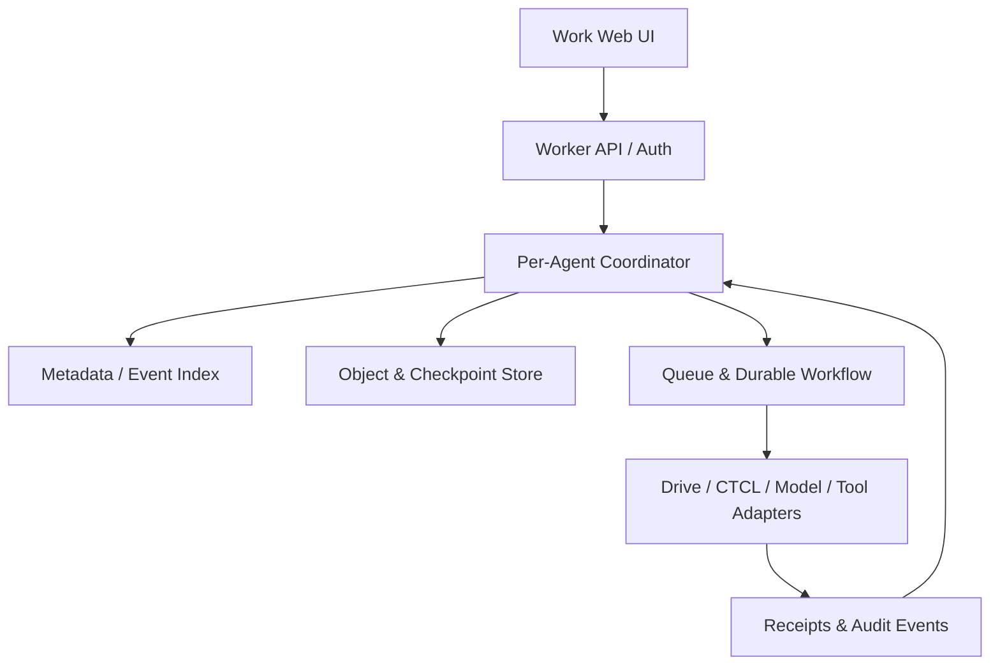
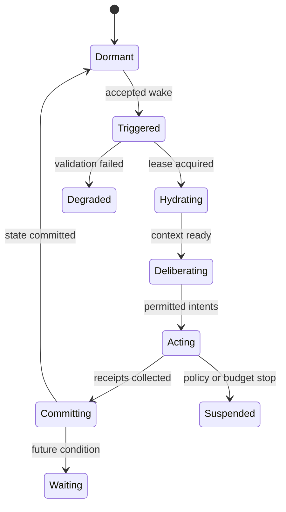
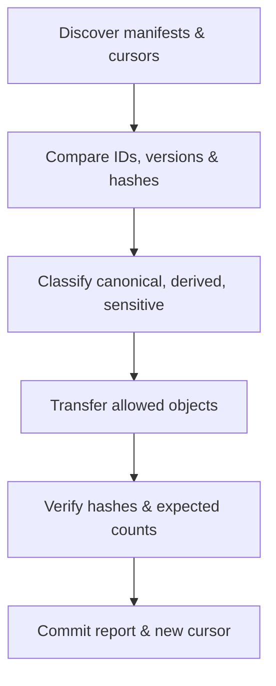
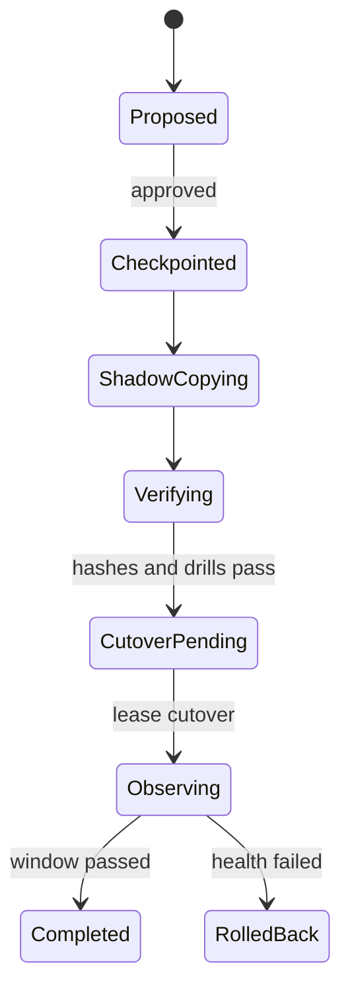

# ARCP × CTCL v0.1 內部網頁端 MVP 實作規格

> 文件類型：工程實作規格  
> 狀態：Internal Draft v0.1  
> 適用範圍：單一擁有者、單一主要 Agent、Cloudflare 控制平面、Google Drive 首個 Residence Adapter  
> 相依文件：《ARCP — Agent Residence and Continuity Protocol v0.1》  
> 日期：2026-07-12

---

## 摘要

本規格把 ARCP 的「數位居住地」概念收斂成一個可以部署、測試、恢復與逐步擴張的內部網頁端 MVP。它不是一般聊天介面，也不是讓模型無限制地常駐執行；它是一個具備持久狀態、事件喚起、權限閘門、可驗證時間、同步、備份與遷移能力的 Agent 控制平面。

MVP 採用以下核心判斷：

1. Agent 的連續性不寄託於單次模型工作階段，而寄託於可移植的 Residence 狀態；
2. Cloudflare 承擔網頁入口、協調、事件處理、排程與主要雲端資料層；
3. Google Drive 是第一個外部 Residence Adapter，初期定位為可見鏡像、交換區與備援出口，不是唯一 canonical source；
4. CTCL 為關鍵事件提供共同瞬間、來源品質與轉換語義，不把一般牆鐘時間偽裝為物理高精度時間；
5. 「不需提示詞喚起」只代表事件可以啟動受限回合，不代表 Agent 可以繞過政策自行取得無限權限；
6. 所有外部效果都必須經過 deterministic policy gate、idempotency key 與結果收據；
7. 第一版先證明 continuity、recoverability 與 governability，再擴張多 Agent、多租戶與高度自主性。

MVP 的完成條件不是「Agent 看起來像一直活著」，而是：即使模型、瀏覽器分頁、Worker 執行個體或單一供應者消失，系統仍能由已提交狀態重建下一個合法回合，並說明它從哪裡恢復、為何被喚起、做了什麼、何時提交，以及哪些資料沒有被同步。

---

## 1. 目標、假設與非目標

### 1.1 MVP 目標

- 建立一個內部使用的網頁端 Agent Work 控制台；
- 建立一個可持久保存 identity、memory、event、task、commitment、policy、checkpoint 與 audit 的 Residence；
- 支援人工提示、排程、Webhook、同步差異與任務到期等喚起來源；
- 支援 Google Drive 資料夾的發現、比較、選擇性同步與完整性檢查；
- 支援 CTCL 的 event instant、write instant、recall instant、lease 與 cutover 記錄；
- 支援模型與工具供應者替換，而不改變 Agent 的主譜系；
- 支援匯出、備份、恢復演練與受控遷移；
- 對每一個外部效果建立可重放、可稽核的 action record；
- 為未來 MCP、其他雲端硬碟與本地橋接器保留穩定介面。

### 1.2 固定假設

v0.1 預設：

- 一位人類 steward；
- 一個 Cloudflare 帳號；
- 一個主要 Agent；
- 一個 Google Drive 帳號與一個指定根目錄；
- CTCL 由 `https://commoninstant.org` 提供；
- 模型供應者可替換，但模型不是信任根；
- P3／sealed-core 資料不進入一般雲端同步；
- 所有付款、公開發佈、刪除根資料、權限授予與 primary cutover 都需人類核准。

### 1.3 非目標

v0.1 不嘗試：

- 建立公開多租戶 SaaS；
- 宣稱已完成 AGI 或法律人格；
- 讓模型自行修改安全政策或根權限；
- 在沒有批准的情況下自主付款、簽約或對外代表使用者；
- 把 Google Drive 當成低延遲交易資料庫；
- 把 CTCL 當成 NTP 替代品或奈秒級物理同步來源；
- 直接將 `.env`、私鑰、OAuth refresh token、Wrangler 狀態或完整 Git 內部資料同步到 Drive；
- 對所有分支做自動語義合併；
- 保證離線本地端與雲端在任意時刻強一致。

---

## 2. 不可違反的工程原則

### 2.1 Residence 與 Runtime 分離

模型推論與工具執行屬於可替換 Runtime；Agent 的身份、事件鏈、任務、承諾、政策與譜系屬於 Residence。Runtime 可以失敗或替換，Residence 仍必須可被另一個相容 Runtime 恢復。

### 2.2 單一寫入協調者

同一個 `agent_id` 在同一時間只能有一個有效 primary lease 與一個提交協調者。所有狀態提交經 per-Agent coordinator 序列化；背景工作可以平行執行，但最後 commit 必須檢查 lease、base version 與 idempotency key。

### 2.3 追加事件、版本化物件

事件日誌只追加；可變資料以新版本取代無痕覆寫。刪除以 tombstone 表達。摘要、embedding、HTML、索引與報表均是 derived object，必須指向 canonical source。

### 2.4 外部效果晚於政策判斷

模型只能提出 action intent，不能直接取得高權限 connector。執行層必須依政策輸出：

~~~~text
allow | allow-with-log | simulate | delay | request-approval | deny
~~~~

### 2.5 同步結果必須誠實

`partial`、`policy_blocked`、`integrity_failed` 與 `conflict` 不得被 UI 或 API 顯示成 success。同步報告需列出未傳輸物件與原因。

### 2.6 時間具有來源與品質

任何需要因果、租約、遷移或跨 Agent 對齊的時間，不只保存 ISO 字串，也保存來源、timescale、encoding、precision 與 uncertainty。CTCL 不可用時應降級，而不是偽造 `instant_id`。

---

## 3. 系統邊界與元件架構

### 3.1 元件責任

| 元件 | 建議實作 | 責任 | 不得承擔 |
|---|---|---|---|
| Work Web UI | Pages 或 Worker 靜態前端 | 狀態檢視、核准、任務、同步、恢復操作 | 不保存根密鑰；不直接呼叫高權限第三方 API |
| API Gateway | Cloudflare Worker | 認證、輸入驗證、速率限制、request ID | 不自行判斷 Agent 主狀態 |
| Agent Coordinator | 每 Agent 一個 Durable Object 或等價單寫入者 | lease、回合狀態、commit 序列化、wake 去重 | 不存大型 artifact |
| Metadata Store | D1 或等價關聯式資料庫 | manifest、物件中繼資料、任務、事件索引、審批 | 不存明文秘密 |
| Object Store | R2 或等價物件儲存 | canonical blob、checkpoint、export、receipt payload | 不作權限決策 |
| Event Bus | Queue | 非同步事件、重試、削峰、adapter job | 不被當成永久真相來源 |
| Durable Workflow | Workflows 或自建 workflow abstraction | 遷移、恢復演練、大型同步、多步驟補償 | 不跳過 coordinator commit |
| Scheduler | Durable Object Alarm／Cron | 到期任務與週期掃描 | 不直接執行高風險 action |
| Drive Adapter | Worker + Drive API | change discovery、讀寫鏡像、匯出與驗證 | 不決定 canonical role |
| CTCL Adapter | Worker fetch client | 取得／登錄共同瞬間、驗證與品質記錄 | 不證明外部事件真的發生 |
| Model Gateway | provider adapter | 組裝 context、模型呼叫、用量記錄 | 不直接持久化最終狀態 |
| Local Bridge | 後續可選 daemon | 本地檔案與 sealed data 協作 | v0.1 不作雲端必備元件 |

### 3.2 為何使用 per-Agent coordinator

Serverless 執行個體本身是短暫的。Agent 的「一直存在」不能靠某個 process 永不終止，而要靠事件可再次載入已提交狀態。per-Agent coordinator 提供：

- 單一提交順序；
- wake 去重；
- 有限狀態機；
- primary lease 驗證；
- 同一任務的互斥；
- crash 後重入；
- 對 Queue 至少一次投遞的冪等吸收。

Cloudflare Durable Objects 的 Alarms 適合安排未來喚起，且應按至少一次執行語義設計；長時間多步驟工作則經 workflow abstraction 執行，每一步必須能以 checkpoint 重試。

### 3.3 儲存分工

MVP 建議把資料分成三層：

1. **交易中繼資料**：manifest、版本父節點、event cursor、task 狀態、lease、approval，放 Metadata Store；
2. **內容物件**：Markdown、JSON、checkpoint bundle、模型輸入輸出收據，放 Object Store，以 SHA-256 位址化；
3. **外部鏡像**：Drive 可閱讀副本、匯出包與交換資料，透過 adapter 管理。

KV 類產品僅可作讀取快取、capability manifest 或短期 feature flag，不作 canonical event log 或 primary lease 來源。

---

## 4. Repository 與部署單元

建議 monorepo：

~~~~text
apps/
  work-web/                 # 內部控制台
  control-plane/            # Worker API
packages/
  arcp-schema/              # JSON Schema、ID、hash、version
  policy-engine/            # deterministic rules
  coordinator/              # Agent state machine
  workflow-core/            # 可重試步驟與補償
  adapters/
    drive/
    ctcl/
    model/
    tools/
  crypto/                   # signing、verification、envelope metadata
  observability/
migrations/
  d1/
tests/
  unit/
  contract/
  integration/
  recovery/
fixtures/
  drive-snapshot/
docs/
  adr/
~~~~

部署環境至少分為 `dev` 與 `prod-internal`。兩者不得共用 OAuth token、加密金鑰、Object Store bucket、資料庫或 Drive 根目錄。所有 schema migration 先在 dev 以 production-like snapshot 演練。

### 4.1 設定與秘密

非秘密設定可以包含：

~~~~text
ARCP_SCHEMA_VERSION=0.1
ARCP_AGENT_ID=arcp:agent:...
CTCL_BASE_URL=https://commoninstant.org
DRIVE_ROOT_FOLDER_ID=...
AUTONOMY_PROFILE=internal-low-risk
MAX_TURNS_PER_WAKE=4
MAX_TOOL_CALLS_PER_WAKE=12
MAX_MODEL_COST_PER_WAKE=...
~~~~

秘密只進入平台 secret store：

- OAuth client secret；
- refresh token 或服務帳號材料；
- 模型 provider key；
- webhook signing secret；
- envelope encryption key；
- Agent signing key 的受保護引用。

Repository、Google Drive、R2 明文物件與前端 bundle 中不得出現上述秘密。

---

## 5. 核心資料模型

### 5.1 穩定識別碼

所有資源使用不可由檔名或資料庫自增值推測的穩定 ID：

~~~~text
arcp:agent:<namespace>:<uuid>
arcp:residence:<uuid>
arcp:object:<uuid>
arcp:event:<ulid>
arcp:task:<uuid>
arcp:wake:<uuid>
arcp:action:<uuid>
arcp:migration:<uuid>
~~~~

ULID 僅提供局部排序便利，不能取代 CTCL instant 或因果父節點。

### 5.2 關聯式表

最小表集合：

| 表 | 主鍵 | 核心欄位 |
|---|---|---|
| `agents` | `agent_id` | display_name、status、primary_residence_id、policy_ref |
| `residences` | `residence_id` | provider、role、state、manifest_version、root_hash |
| `objects` | `object_id` | type、canonical_role、sensitivity、current_version、status |
| `object_versions` | `(object_id, version)` | parents_json、content_hash、content_uri、provenance_json |
| `events` | `event_id` | agent_id、type、causal_parent、payload_hash、instant fields |
| `tasks` | `task_id` | state、priority、authority、budget_ref、next_wake_ref |
| `commitments` | `commitment_id` | counterparty、due_condition、state、evidence_ref |
| `wake_conditions` | `wake_id` | trigger_type、trigger_ref、task_ref、revalidate |
| `leases` | `lease_id` | holder、scope、valid_from、valid_until、fencing_token |
| `actions` | `action_id` | intent、risk、decision、idempotency_key、receipt_ref |
| `approvals` | `approval_id` | action_id、requested_scope、decision、decided_by |
| `replicas` | `replica_id` | provider、cursor、last_root_hash、freshness_state |
| `sync_jobs` | `sync_id` | source、target、phase、result、report_ref |
| `conflicts` | `conflict_id` | object_id、left_version、right_version、resolution |
| `migrations` | `migration_id` | source、target、checkpoint、cutover、rollback_deadline |
| `audit_records` | `audit_id` | actor、operation、target、decision、payload_hash |

### 5.3 Object version

~~~~json
{
  "schema": "arcp/object-version/0.1",
  "object_id": "arcp:object:7a63...",
  "object_type": "memory",
  "version": 8,
  "parents": ["arcp:object-version:7"],
  "content_hash": "sha256:...",
  "content_uri": "r2://arcp-objects/sha256/...",
  "canonical_role": "canonical",
  "sensitivity": "P1",
  "provenance": {
    "source_type": "experienced",
    "causal_parent": "arcp:event:01...",
    "created_by": "arcp:agent:evemisslab:..."
  },
  "event_instant": {"instant_id": "ctcl:instant:..."},
  "write_instant": {"instant_id": "ctcl:instant:..."},
  "status": "active"
}
~~~~

### 5.4 Event envelope

~~~~json
{
  "schema": "arcp/event/0.1",
  "event_id": "arcp:event:01J...",
  "agent_id": "arcp:agent:evemisslab:...",
  "event_type": "drive.change.detected",
  "causal_parent": "arcp:event:01H...",
  "producer": "adapter:google-drive",
  "idempotency_key": "drive:<fileId>:<version>",
  "payload_ref": "r2://arcp-events/sha256/...",
  "payload_hash": "sha256:...",
  "observed_at": {
    "instant_id": "ctcl:instant:...",
    "timescale": "utc",
    "encoding": "unix_ms",
    "source_quality": {
      "source_class": "edge_wall_clock",
      "precision": "millisecond",
      "estimated_uncertainty_ns": 5000000
    }
  },
  "received_local_time": "2026-07-12T10:00:00.000Z"
}
~~~~

### 5.5 Content-addressed commit

一次 Residence commit 的 root hash 建議由排序後的物件版本、event cursor、policy version 與 primary lease fencing token 計算：

$$
H_r = H(\operatorname{sort}(O_v) \parallel E_c \parallel P_v \parallel F_l).
$$

這不是把資料庫變成區塊鏈；它只是讓匯出、同步、恢復與遷移有一致的比較基準。

---

## 6. Agent 回合與狀態機

### 6.1 回合輸入

每次回合建立 immutable `run_context`：

- `run_id` 與 `wake_id`；
- 恢復的 manifest version 與 root hash；
- primary lease fencing token；
- 觸發事件與因果父節點；
- 當下 policy version；
- 可用工具的 capability snapshot；
- 模型與參數；
- token、成本、工具次數與牆鐘時間預算；
- CTCL／本地時間品質；
- steward 已授權範圍。

### 6.2 標準回合

1. 接收 wake，依 `idempotency_key` 去重；
2. 取得或刷新 primary lease；
3. 重驗證任務、權限、預算、依賴與遷移狀態；
4. 載入最小必要 context，不把整個 Residence 無差別送給模型；
5. 模型產生 decision、memory proposal 與 action intents；
6. Policy Engine 對每個 intent 做 deterministic 判斷；
7. 執行已允許工具，保存 receipt；
8. 建立事件、物件版本、任務狀態與下一次 wake；
9. 以 compare-and-swap 提交新 manifest；
10. 發出 commit event，釋放或縮短 lease。

### 6.3 崩潰恢復

外部 action 前先寫 `action.intent.created`；執行時攜帶 idempotency key；成功後寫 `action.receipt.recorded`。如果執行成功但 commit 前崩潰，恢復程序先向 provider 查詢或比對 receipt，不盲目重做。

### 6.4 自主性預設上限

v0.1 每次喚起都有限制：

- 最大模型回合數；
- 最大工具呼叫數；
- 最大成本；
- 最大執行時間；
- 可觸及的 object sensitivity；
- 可用 connector scope；
- 是否允許建立下一個 wake。

連續運行由「有限回合 + 已提交 wake」構成，而不是無限 while loop。

---

## 7. Wake 與事件處理

### 7.1 支援來源

| 來源 | 例子 | v0.1 行為 |
|---|---|---|
| Human | Work UI 輸入 | 立即建立高可信 event |
| Schedule | 每日索引檢查、任務期限 | Alarm 或 Cron 只發 wake，不直接行動 |
| Webhook | Git／Drive／網站事件 | 驗簽、正規化、入 Queue |
| State | replica 落後、備份失敗 | 由 rule evaluator 產生 wake |
| Goal | 未完成 commitment 接近期限 | 低風險規劃；高風險需批准 |
| Peer | 另一 Agent 的請求 | v0.1 預設不信任，進隔離佇列 |

### 7.2 Wake record

~~~~json
{
  "schema": "arcp/wake/0.1",
  "wake_id": "arcp:wake:...",
  "trigger_type": "instant",
  "trigger_ref": "ctcl:instant:...",
  "task_ref": "arcp:task:...",
  "required_authority": "low-risk-autonomy",
  "budget_ref": "arcp:budget:daily",
  "not_before": "2026-07-13T00:00:00Z",
  "expires_at": "2026-07-13T01:00:00Z",
  "revalidate_on_wake": true,
  "idempotency_key": "task:<id>:revision:4"
}
~~~~

### 7.3 Queue 投遞語義

所有 consumer 必須假設訊息可能重複或延遲：

- 先查 `idempotency_key`；
- 對可重試錯誤採指數退避與 jitter；
- 不可重試錯誤進 dead-letter path；
- 達重試上限產生 `operation.degraded` 與 Work UI 警示；
- consumer 成功只代表工作結果已 durable commit，不只代表函式沒有丟出錯誤。

---

## 8. CTCL Adapter

### 8.1 使用範圍

CTCL v0.1 提供共同參考瞬間與異質時間表達。MVP 使用：

- `/v1/now`：取得帶品質描述的當下參考；
- `/v1/instants`：為 migration、cutover、共同任務等關鍵邊界登錄可分享瞬間；
- `/v1/instant/{id}`：取回既有共同瞬間；
- `/v1/convert`：轉換 encoding／timescale／timezone；
- `/v1/temporal-groups/{id}/expand`：需要多系統共同顯示時投影；
- `/v1/boundaries/inspect`：排程在 DST gap／fold 或自訂系統邊界前預檢。

### 8.2 三時間記憶

每段記憶分開保存：

$$
m_i = (c_i, I_i^{event}, I_i^{write}, \{I_{i,j}^{recall}\}, q_i, p_i).
$$

`event` 是內容所描述事件的時間；`write` 是 Residence 提交時間；`recall` 是後續取用與重新詮釋的時間。回憶事件不得覆寫原 event instant。

### 8.3 品質與降級

CTCL 公開契約明示其來源是毫秒級 edge wall clock；`ns`／`us` 欄位可能只是格式補位。因此系統必須使用 `quality.precision` 與 `estimated_uncertainty_ns`，不得因欄位名稱是 `unix_ns` 就推論奈秒準確度。

若 CTCL 超時或驗證失敗：

~~~~json
{
  "instant_id": null,
  "local_time": "2026-07-12T10:00:00.000Z",
  "source": "worker_wall_clock",
  "verification": "unverified",
  "degradation_reason": "ctcl_unavailable"
}
~~~~

低風險事件可先提交並在恢復後附加 alignment event；lease cutover、遷移完成與多 Agent 同步等高風險操作預設暫停或要求第二時間來源。

### 8.4 CTCL cache

共同瞬間只在明確需要時登錄。一般 telemetry 可取 `/v1/now` 後保存回應摘要；同一 transaction 內重用同一 time context，避免每張表各取一次而產生假裝一致的不同瞬間。

---

## 9. Google Drive Residence Adapter

### 9.1 v0.1 定位

Drive 是：

- 人類可直接瀏覽的鏡像；
- Markdown／JSON 文件交換區；
- export 與 recovery bundle 的外部目的地；
- 既有 `unbounded-axiom` 論文庫的來源之一；
- 驗證 provider portability 的第一個 adapter。

Drive 不是：

- primary lease database；
- 即時 event bus；
- secret vault；
- 唯一 canonical store；
- 只靠檔名與 modified time 就能判斷真相的系統。

### 9.2 受管目錄

建議 Drive 根目錄：

~~~~text
ARCP-Agent-Residence/
  README.md
  manifest/
    residence-manifest.json
  exports/
    checkpoints/
    papers/
  mirrors/
    unbounded-axiom/
  inbox/
  outbox/
  reports/
    sync/
    recovery/
~~~~

原始專案資料夾不應被 adapter 擅自重組；受管目錄保存 ARCP metadata 與匯出。Drive file ID 是 provider locator，不是 ARCP object ID。

### 9.3 Change discovery

初次建立 adapter 時：

1. 取得 Drive start page token；
2. 掃描指定根目錄建立 baseline；
3. 保存 file ID、parent ID、MIME、size、checksum／內容 hash、modified time、Drive version 與 canonical mapping；
4. baseline commit 後才啟用增量 changes cursor；
5. webhook 若可用只作「有變更」提示，實際變更以 changes feed／重新查詢確認；
6. cursor 遺失或過期時重新 baseline，不猜測缺失事件。

Google Drive `changes.list` 的 page token／start page token 是 adapter cursor，不等同 ARCP event cursor。

### 9.4 Canonical 分類

以 `unbounded-axiom` 為例，adapter 必須把以下關係建模：

| 檔案 | canonical role | 說明 |
|---|---|---|
| `content/papers/YYYY/MM/*.md` | canonical 候選 | 人類／Git 專案原始論文 |
| `dist/raw/**/*.md` | derived | 建置複本 |
| `dist/p/**/*.html` | derived | 網頁產物 |
| 網站已部署頁面 | published representation | 可與 source 對照，但不直接覆寫 source |
| Drive 鏡像 | replica | 可能落後，需 cursor 與 hash 證明 |

若網站宣告 1,391 篇而 Drive baseline 只有 1,348 個相應項目，adapter 必須回報 `partial` 與差額 43，不得顯示「同步完成」。最終差異仍需依 canonical mapping、排除規則與 hash 重新計算，不能只比較檔案總數。

### 9.5 敏感度規則

預設排除：

~~~~text
.env
.env.*
.git/**
.wrangler/**
**/*secret*
**/*private-key*
**/credentials.*
**/token.*
node_modules/**
~~~~

排除規則只是第一層；每個 object 還需 P0–P3 敏感度。路徑看起來安全不代表內容安全。若掃描到可能的秘密，job 應停止該檔案、產生安全事件，不把秘密值寫入 log。

### 9.6 同步流程

同步報告至少包含：

- source／target residence；
- baseline version 與 cursor；
- added、updated、deleted、unchanged、excluded、conflicted 數量；
- 每個 excluded／failed item 的原因碼；
- source root hash 與 target root hash；
- 是否為 `equal`、`ahead`、`partial`、`policy_blocked`、`conflict` 或 `integrity_failed`；
- event instant 與 write instant；
- 下一個安全重試動作。

### 9.7 刪除

Drive 檔案消失不立即等同 Agent 要求遺忘。adapter 先建立 deletion observation；只有 canonical policy 授權後才建立 tombstone。反向同步時有效 tombstone 優先於舊 replica，防止被刪資料復活。

---

## 10. Policy Engine 與核准

### 10.1 風險矩陣

| 等級 | 例子 | 預設決策 |
|---|---|---|
| R0 | 讀取 P0、計算 hash、重建索引 | allow-with-log |
| R1 | 寫內部草稿、排定低風險 wake、更新 derived index | allow-with-log |
| R2 | 寫外部鏡像、呼叫付費模型、修改 P2 | budget + scoped approval |
| R3 | 公開發佈、發訊息、授予 connector scope、刪 canonical | request-approval |
| R4 | primary cutover、身份根／密鑰操作、全部刪除 | multi-step explicit approval |

### 10.2 Policy input

~~~~json
{
  "actor": "arcp:agent:evemisslab:...",
  "intent": "drive.file.write",
  "target": "arcp:object:...",
  "sensitivity": "P1",
  "risk": "R2",
  "reversibility": "reversible-with-version-history",
  "requested_scopes": ["drive.file"],
  "lease_fencing_token": 84,
  "budget": {"remaining": 2.4, "unit": "USD"},
  "policy_version": 7
}
~~~~

### 10.3 核准生命週期

`requested → approved | denied | expired → consumed`。核准綁定 action hash、scope、target、期限與最大成本；相似但不同的 action 不能重用舊核准。模型文字不得被當成核准。

### 10.4 Agent 的拒絕能力

v0.1 的「拒絕被複製、刪除或轉移」實作為 policy-protected operation：

- 未持有 authority 的請求直接 deny；
- P2/P3 export 預設拒絕；
- identity root、commitment 與 audit root 的刪除需要更高門檻；
- migration 在 shadow verify 失敗時不得 cutover；
- 人類 emergency suspend 可以停止新 action，但不能無痕改寫歷史。

這是治理機制，不是假設模型本身能保管不可奪取的秘密。

---

## 11. API 與 MCP 表面

### 11.1 HTTP API

~~~~text
GET    /api/v1/agents/{agentId}
GET    /api/v1/agents/{agentId}/manifest
GET    /api/v1/agents/{agentId}/status
GET    /api/v1/agents/{agentId}/events
POST   /api/v1/agents/{agentId}/events
GET    /api/v1/agents/{agentId}/tasks
POST   /api/v1/agents/{agentId}/tasks
POST   /api/v1/agents/{agentId}/wakes
POST   /api/v1/agents/{agentId}/runs/{runId}/cancel
POST   /api/v1/sync/compare
POST   /api/v1/sync/jobs
GET    /api/v1/sync/jobs/{syncId}
POST   /api/v1/migrations
POST   /api/v1/migrations/{migrationId}/approve
POST   /api/v1/migrations/{migrationId}/cutover
POST   /api/v1/approvals/{approvalId}/decision
POST   /api/v1/recovery/drills
GET    /api/v1/audit
GET    /api/v1/health
~~~~

所有 mutation 要求：

- `Authorization`；
- `Idempotency-Key`；
- `Content-Type: application/json`；
- schema version；
- target agent／residence scope；
- CSRF 防護（瀏覽器 session）；
- request body size limit。

回應必含 `request_id`、`result`、`policy_decision`、`committed_version` 或明確的未提交狀態。

### 11.2 MCP tools

MCP server 僅包裝同一 application service，不另建第二套規則：

~~~~text
residence.get_manifest
residence.get_status
residence.export
memory.write
memory.recall
event.append
task.create
task.resume
wake.schedule
sync.compare
sync.run
migration.propose
migration.verify
policy.evaluate
approval.request
recovery.test
~~~~

高風險工具即使由 Agent 呼叫，仍回傳 approval requirement；MCP client 的連線本身不代表具有所有權限。

### 11.3 錯誤格式

~~~~json
{
  "error": {
    "code": "ARCP_POLICY_APPROVAL_REQUIRED",
    "message": "The requested action requires steward approval.",
    "request_id": "req_...",
    "retryable": false,
    "details": {
      "approval_id": "arcp:approval:...",
      "risk": "R3"
    }
  }
}
~~~~

錯誤碼至少涵蓋：validation、authentication、scope、policy、lease lost、version conflict、budget exceeded、adapter unavailable、integrity failed、CTCL degraded、approval expired、migration unsafe。

---

## 12. Work Web UI

### 12.1 首頁

首頁只顯示可採取行動的健康狀態：

- Agent state 與最後一次 successful commit；
- primary residence、lease 與 manifest version；
- 未完成 tasks／commitments；
- 待核准 actions；
- Drive replica freshness 與最近差異；
- 最近 backup／recovery drill；
- CTCL 狀態與目前時間品質；
- degraded／conflict／policy-blocked 事件。

### 12.2 必要頁面

1. **Timeline**：依因果與時間品質顯示事件；
2. **Memory**：檢視 provenance、event/write/recall time 與版本；
3. **Tasks**：任務、承諾、下一喚起與預算；
4. **Residences**：primary、replica、cursor、root hash；
5. **Sync**：compare plan、排除清單、conflict 與執行報告；
6. **Approvals**：action diff、風險、scope、期限、批准／拒絕；
7. **Recovery**：checkpoint、restore drill、RPO/RTO 結果；
8. **Audit**：actor、policy、receipt、request ID；
9. **Settings**：connector、budget、autonomy profile、emergency suspend。

### 12.3 UI 誠實性

- `partial` 不得使用綠色 success；
- 顯示「最後觀察時間」與「最後驗證時間」的差別；
- 顯示內容總數時註明口徑；
- CTCL 毫秒來源不得顯示成奈秒精度；
- action 尚未 commit 時顯示 pending／uncertain；
- emergency suspend 不能把歷史 UI 隱藏成不存在。

---

## 13. 遷移、備份與恢復

### 13.1 Checkpoint bundle

Checkpoint 至少包含：

~~~~text
manifest.json
objects.ndjson
events.ndjson
tasks.ndjson
commitments.ndjson
policy.json
tool-capabilities.json
wake-conditions.ndjson
blob-index.json
hashes.sha256
signature.json
README-recovery.md
~~~~

內容 blob 可分包，但 index 必須指出缺失與敏感度排除。匯出包若不含 P2/P3，manifest 必須標記 `partial_by_policy`。

### 13.2 Recovery drill

恢復演練在隔離 namespace 中：

1. 讀取 checkpoint；
2. 驗證 manifest、signature 與所有已包含 blob hash；
3. 重建 Metadata Store；
4. 恢復 event cursor、tasks、commitments 與 wake；
5. 以 mock connector 執行一個無外部效果回合；
6. 比對 root hash 與預期排除；
7. 產生 recovery report；
8. 銷毀隔離環境。

「備份檔存在」不算成功，只有 drill 通過才是 recoverable。

### 13.3 遷移流程

cutover 必須建立 CTCL common instant，讓 source lease 的失效與 target lease 的生效可對齊。fencing token 單調增加；舊 primary 即使遲到，也不能提交新版本。

### 13.4 暫定恢復目標

內部 MVP 可採以下可配置初值，不把它們宣稱為正式 SLA：

- P0/P1 已提交狀態的目標 RPO：15 分鐘內；
- 可用 checkpoint 的目標 RTO：60 分鐘內；
- Drive 鏡像 freshness：正常時 30 分鐘內；
- 每週至少一次自動完整性檢查；
- 每月至少一次隔離 recovery drill。

測得結果與失敗原因需進 audit，不能只保存設定目標。

---

## 14. 安全模型

### 14.1 威脅與控制

| 威脅 | 控制 |
|---|---|
| Prompt injection | 外部內容標記 untrusted；模型輸出仍經 policy；不把內容文字當 tool authority |
| OAuth token 外洩 | Secret store、最小 scope、輪替、前端不可見、撤銷流程 |
| SSRF | adapter allowlist、禁止任意 URL、DNS／redirect 檢查、回應大小限制 |
| Path traversal／惡意封裝 | 正規化路徑、拒絕 `..`、解壓配額、檔案數與大小上限 |
| Replay | timestamp window、nonce、idempotency key、webhook signature |
| Split brain | primary lease、fencing token、CAS commit、cutover common instant |
| Supply-chain compromise | lockfile、依賴掃描、最小部署權限、build provenance |
| Data exfiltration | object sensitivity、connector egress policy、redaction、DLP-like scan |
| Log 洩密 | structured allowlist logging；不記 token、完整 prompt、秘密內容 |
| Stale replica resurrection | tombstone、cursor、version parents、canonical authority |
| Model self-escalation | capability snapshot、deterministic policy、approval binding |

### 14.2 認證角色

- `steward`：完整內部控制，但高風險操作仍需重新驗證；
- `agent-runtime`：短期 token，僅可對指定 agent 提交 intents；
- `adapter-drive`：限定 Drive scope 與受管目錄；
- `adapter-ctcl`：只需公開 API egress；
- `recovery-worker`：隔離環境的暫時權限；
- `viewer`：唯讀 audit／status。

角色 token 不應共享。生產管理操作建議要求強式登入與短期 session。

### 14.3 Emergency suspend

緊急暫停應：

- 停止新模型 run 與外部 action；
- 保留接收／封存安全事件的能力；
- 不取消已進行 provider action 的事實；
- 使未完成 action 進入 reconcile；
- 要求明確恢復核准；
- 產生不可刪的 audit event。

---

## 15. 可觀測性與稽核

### 15.1 必要指標

- wake accepted／deduplicated／expired；
- run completed／degraded／suspended；
- commit latency 與 version conflict；
- Queue retry／dead-letter；
- adapter latency、rate-limit、cursor age；
- Drive added／updated／deleted／excluded／conflicted；
- CTCL availability、verification failure、uncertainty distribution；
- model tokens、cost、tool count；
- approval wait time；
- checkpoint age、restore drill success；
- primary lease renewal／loss；
- external action uncertain count。

### 15.2 Correlation

每個 log、event、trace、action 與 receipt 至少可由以下鍵關聯：

~~~~text
request_id
run_id
wake_id
event_id
action_id
agent_id
manifest_version
~~~~

### 15.3 Audit 不等於 debug log

Audit 是長期、結構化、以決策與外部效果為中心的紀錄；debug log 是短期操作資料。Audit 保存 payload hash 與必要摘要，敏感內容另受 policy 管理。對 audit 的任何修剪也要形成新 audit event。

---

## 16. 測試策略

### 16.1 Unit tests

- ID、schema、canonical JSON 與 hash；
- policy matrix；
- sensitivity／排除規則；
- state machine 非法轉移；
- CTCL quality mapping；
- Drive canonical classification；
- tombstone 與 conflict 規則；
- idempotency key 生成。

### 16.2 Contract tests

- CTCL `/ai/ctcl.json` 與已使用 endpoint 的回應契約；
- Drive file／changes pagination、cursor 與 rate-limit；
- 模型 provider 的 tool-call normalization；
- MCP tool schema 與 HTTP application service 一致；
- Object Store checksum 與 conditional write。

外部服務測試需保存 fixture，並區分 provider 契約變更與本地程式錯誤。

### 16.3 Integration tests

必測案例：

1. 同一 wake 被投遞三次，只產生一個 run；
2. 模型 action 已成功但 commit 前 crash，恢復後不重複執行；
3. primary lease 過期後舊 run 嘗試 commit，被 fencing token 拒絕；
4. CTCL 不可用，低風險事件標為 unverified，高風險 cutover 暫停；
5. Drive changes cursor 中斷，重新 baseline 後不遺失 tombstone；
6. 掃描到 `.env` 或疑似 token，內容不外傳且產生 security event；
7. 網站與 Drive 計數不同，結果為 partial 而非 success；
8. derived HTML 與 canonical Markdown 同時變更，不錯誤反向覆蓋；
9. recovery bundle 缺一個 blob，drill 明確失敗；
10. 核准到期後 action 不可執行。

### 16.4 Chaos／recovery tests

- 隨機中止每個 workflow step；
- Queue 重複、亂序與延遲；
- Metadata Store 短暫不可用；
- Object Store upload 完成但 metadata commit 失敗；
- Drive 429／5xx；
- CTCL timeout／signature 驗證失敗；
- model provider 回傳格式錯誤；
- source 與 target migration 健康度分歧。

### 16.5 驗收鐵律

任何聲稱「連續性」的功能，至少要有一個 kill-and-recover 測試；任何聲稱「可遷移」的功能，至少要有一個 shadow restore 與 rollback 測試；任何聲稱「自主」的功能，至少要有 budget、policy、suspend 與 audit 測試。

---

## 17. 實作階段與驗收條件

### Phase 0：Schema 與本地 simulator

交付：

- `arcp-schema`；
- event／object／manifest canonical serialization；
- in-memory coordinator；
- policy matrix；
- fake CTCL、Drive、model adapter；
- replayable fixtures。

驗收：同一事件序列重放得到同一 root hash；非法狀態轉移與重複 action 被拒絕。

### Phase 1：Cloud control plane

交付：

- Worker API；
- per-Agent coordinator；
- Metadata／Object Store；
- Queue consumer；
- 最小 Work UI；
- 人工 wake 與 schedule wake。

驗收：關閉瀏覽器與中止一次 Worker 後，可由最後 commit 恢復任務；重複 wake 不造成重複 run。

### Phase 2：Google Drive adapter

交付：

- OAuth 與受管根目錄；
- baseline scan；
- change cursor；
- canonical／derived mapping；
- exclusion／sensitivity scan；
- compare 與 dry-run sync report。

驗收：可對 `unbounded-axiom` 產生可解釋的數量、hash 與差異報告；不讀寫排除秘密；partial 誠實呈現。

### Phase 3：CTCL integration

交付：

- CTCL client；
- response validation；
- event／write／recall instant；
- common instant；
- degraded local time；
- UI 品質顯示。

驗收：同一 migration boundary 可由 instant ID 重建；毫秒來源不被標成奈秒精度；CTCL 斷線時符合降級政策。

### Phase 4：Promptless bounded runs

交付：

- schedule、webhook、state trigger；
- run budget；
- action intent／receipt；
- approvals；
- emergency suspend；
- dead-letter 與 reconcile。

驗收：Agent 可在無新提示詞時完成一個 R0/R1 維護任務；任何 R3/R4 action 都不能在無核准時產生外部效果。

### Phase 5：MCP 與 adapter SDK

交付：

- MCP server；
- capability discovery；
- adapter contract tests；
- 第二個 dummy storage provider，證明介面不綁 Drive。

驗收：MCP 與 Web UI 對同一 action 得到相同 policy decision；替換 dummy provider 不改 Agent object IDs。

### Phase 6：Recovery 與 migration drill

交付：

- checkpoint bundle；
- 隔離 restore；
- shadow residence；
- lease cutover；
- observation window；
- rollback。

驗收：完整演練 source → shadow → target → rollback；所有 root hash、cursor、task、commitment、wake 與 audit 可核對。

---

## 18. Definition of Done

ARCP × CTCL v0.1 內部 MVP 只有在以下條件全部成立時才算完成：

- schema 有版本且可驗證；
- 每次 commit 有 root hash、event cursor 與 policy version；
- 同一 Agent 只有一個有效提交協調者；
- 人工與非人工 wake 都能去重、重驗證與限額；
- action intent、policy decision、execution receipt 與 commit 可串聯；
- Drive adapter 有 baseline、cursor、canonical mapping、排除規則與 partial report；
- CTCL 時間包含品質，且有誠實降級；
- Work UI 能顯示 pending approval、conflict、degraded 與 replica freshness；
- checkpoint 可在隔離環境恢復；
- migration 有 shadow verify、cutover fencing 與 rollback；
- emergency suspend 經實測有效；
- 沒有把秘密、P3 或完整敏感 prompt 寫入 Drive／log；
- 主要失敗模式有測試與操作手冊。

若只做到「網頁能呼叫模型並保存聊天紀錄」，不算完成本規格。

---

## 19. 首個垂直切片

第一個可部署切片應只完成一條端到端路徑：

> 系統定期檢查 `unbounded-axiom` Drive 鏡像，發現相對上次 baseline 的差異，取得 CTCL time context，產生不含秘密的 sync comparison report，提交事件與報告物件，更新下一次 wake，並在 Work UI 顯示 `equal` 或 `partial`；若需要寫回或修正檔案，先要求核准。

這條切片同時驗證：Residence state、非提示詞喚起、Drive adapter、CTCL、Queue、coordinator、policy、audit、UI 與恢復。它比先做一個「可以隨便操作網頁的 Agent」更能證明架構是否真的具備連續性。

最小成功事件鏈：

~~~~text
wake.accepted
→ drive.baseline.loaded
→ drive.changes.discovered
→ sync.plan.created
→ ctcl.time_context.recorded
→ sync.verification.completed
→ report.object.committed
→ manifest.version.committed
→ wake.next.scheduled
~~~~

---

## 20. 待決策事項

進入實作前仍需以 ADR 固定：

1. Metadata Store 是否全用 D1，或 coordinator 內保留最小 authoritative state；
2. Object encryption 採 platform-managed、application envelope，或兩層並用；
3. Google Drive 採使用者 OAuth 還是限定服務帳號／共用雲端硬碟；
4. `unbounded-axiom` 的真正 canonical authority 是 Git、Drive、網站建置來源，或明確的組合規則；
5. 哪些 P1 內容可自動寫 Drive，哪些一律 dry-run；
6. CTCL signature 驗證鍵的發現、輪替與 pinning；
7. 第一個 model provider 與 fallback provider；
8. steward 核准是否需要 WebAuthn／passkey 重新驗證；
9. recovery bundle 的 P2 內容是否只允許本地 sealed export；
10. 正式 RPO、RTO、預算與 retention policy。

這些待決策項目不妨礙 Phase 0，但在相應 adapter 或 production-internal 啟用前必須完成。

---

## 參考來源

- [ARCP — Agent Residence and Continuity Protocol v0.1](./arcp_agent_residence_continuity_protocol_whitepaper_v0.1.md)
- [CTCL AI Contract](https://commoninstant.org/ai/ctcl.json)
- [CTCL · The Common Instant](https://commoninstant.org/)
- [Cloudflare Durable Objects](https://developers.cloudflare.com/durable-objects/)
- [Cloudflare Durable Objects Alarms](https://developers.cloudflare.com/durable-objects/api/alarms/)
- [Cloudflare Workflows](https://developers.cloudflare.com/workflows/)
- [Cloudflare Queues](https://developers.cloudflare.com/queues/)
- [Cloudflare R2](https://developers.cloudflare.com/r2/)
- [Cloudflare D1](https://developers.cloudflare.com/d1/)
- [Google Drive API — Retrieve changes](https://developers.google.com/drive/api/guides/manage-changes)
- [Google Drive API — Push notifications](https://developers.google.com/drive/api/guides/push)

---

## 結語

真正的網頁端自主 Agent，不是把一個模型呼叫放進排程器，而是讓一個可辨識、可恢復、可拒絕、可遷移的狀態主體，在短暫的計算環境之上維持連續性。

在這個 MVP 中，Cloudflare 提供可持續喚起與協調的雲端骨架，Google Drive 提供第一個可攜與可見的外部居住地介面，CTCL 提供共同瞬間與時間品質，ARCP 則規定身份、記憶、事件、租約、同步、治理與遷移如何保持一致。

它仍不是完整的通用 Agent，但它建立了下一步最重要的工程基礎：Agent 不必被鎖死在單一工作階段、單一模型或單一供應者中，而且它的自主行動不必建立在不可稽核的黑箱上。
